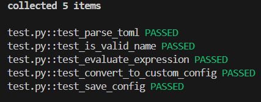

# Описание
Этот проект представляет собой инструмент командной строки для перобразования текста из входного формата (toml) в выходной (учебный конфигурационный язык)
# Установка
Для начала, убедитесь, что у вас установлен Python. Затем выполните следующие шаги:
1.Установка программы и переход в директорию
```
git clone <URL репозитория>
cd <директория проекта>
```
2.Создайте и активируйте виртуальное окружение:
```
python3 -m venv venv
source venv/bin/activate  # Для Linux/Mac
venv\Scripts\activate     # Для Windows
```
3.Установите необходимые зависимости (pytest для тестов)
```
pip install pytest
```
# Запуск скрипта
Скрипт принимает текст конфигурационного файла через стандартный ввод и выводит в файле.

Пример запуска:
```
python main.py input.toml output.txt
```
Здесь:
- input.toml — файл с конфигурационными данными на языке toml.
- output.txt — файл с конфигурационными данными на учебном языке.

# Примеры входных и выходных данных:
### Входные данные (TOML):
```
# Comment 1
Max_connections = 100
Timeout = 30
Ports = [80, 443, 8080]
```
### Выходные данные:
```
! Comment 1
Max_connections: 100;
Timeout: 30;
Ports: array(80, 443, 8080);
```
# Тесты
Шаги запуска тестов:
1. Установить библиотеку pytest (необходимо, если не сделано ранее):
```
pip install pytest
```
2.Для запуска тестирования необходимо запустить следующий скрипт:
```
pytest -v
```
## Прохождение тестов:
